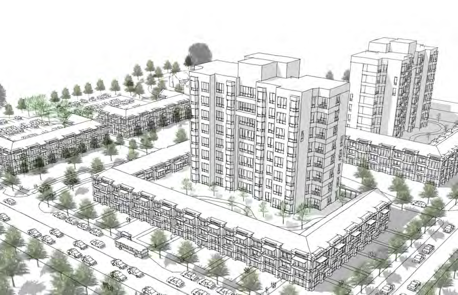

## 4.1.1 Purpose

The D-R zone addresses residential campuses, sometimes comprised of garden apartments or towers in a park, and organized as a large-scale, integrated development.

## 4.1.2 General

All development in the D-R zone must comply with the form standards of this section, as well as any applicable standards in other sections, including the following:

<TableSmall>
| | |
| --- | --- |
| Principal Uses | Section 6.1 |
| Accessory Uses | Section 6.2 |
| Temporary Uses | Section 6.3 |
| Landscape | Section 7.1 |
| Fences and Walls | Section 7.2 |
| Stormwater | Section 7.3 |
| Outdoor Lighting | Section 7.4 |
| Corner Visibility | Section 7.5 |
| Site Impacts | Section 7.6 |
| Pedestrian Access | Section 8.1 |
| Bicycle Access and Parking | Section 8.2 |
| Vehicle Access and Parking | Section 8.3 |
| Transportation Demand Management | Section 8.4 |
| On-Premise Signs | Section 9.2 |
| Blocks | Section 10.1 |
| Rights-of-Way | Section 10.2 |
| Nonconformities | Section 12.1 |
</TableSmall>

## 4.1.3 Lot

**Lot Dimensions**

<TableSmall>
| | | |
| --- | --- | --- |
| **A** | Lot area (min) | N/A |
| | Lot width (min) | N/A |
</TableSmall>

**Lot Coverage**

<TableSmall>
| | | |
| --- | --- | --- |
| **B** | Building coverage (max) | 80% |
| **C** | Impervious coverage (max) | 90% |
</TableSmall>

## 4.1.4 Siting

**Building Setbacks**

<TableSmall>
| | | |
| --- | --- | --- |
| **A** | Front yard (min) | 0’ |
| **B** | Corner side yard (min) | 0’ |
| **C** | Interior side yard (min) | 0’ |
| **D** | Rear yard (min) | 0’ |
</TableSmall>

## 4.1.5 Height

**Building Height**

<TableSmall>
| | | |
| --- | --- | --- |
| **A** | Building height (max) | 3 stories1 |
</TableSmall>

**Supplemental Standards**

1 The maximum height may be increased to up to 1 times the height of the widest adjacent thoroughfare, plus 1’ for each 1’ of upper story stepback, only with approval of City Planning Board as part of major site plan review.

**Story Height**

<TableSmall>
| | | |
| --- | --- | --- |
| **B** | Finished ground floor level (min/max) | 0’/4’ |
</TableSmall>

## 4.1.6 Activation

**Transparency**

<TableSmall>
| | | |
| --- | --- | --- |
| **A** | Ground floor transparency, front facade (min) | 20% for residential uses; 70% for retail & service uses; 40% for all other uses |
| **B** | Ground floor transparency, corner side facade (min) | 20% for residential uses; 40% for all other uses |
| **C** | Upper floor transparency, front and corner side facades (min) | 20% |
</TableSmall>

**Pedestrian Access**

<TableSmall>
| | | |
| --- | --- | --- |
| **D** | Main entrance location (preferred) | Front facade |
</TableSmall>

## 4.1.7 Specific Standards

1. For lots of one acre or more in area, a minimum of 10% of total contiguous area under single ownership or control must be devoted to
   accessible open space, such as squares, greens, or greenways, located at high-use portions of the site. This open space should be framed by building facades where possible and should comply with the standards of the D-OS and/or D-OG zone. In lieu of site-by-site compliance, property owners of contiguous lots within the same zone may provide this accessible open space on an aggregate basis, so long as the total area of the space is equal to or greater than the combined minimum required area of accessible open space for each individual lot and the space is within 1,320 feet of sites served.
2. All principal buildings, with the exception of those located more than 200 feet from a public
   thoroughfare, must be oriented to the thoroughfares onto which they face, with front and corner facades positioned parallel or radial to adjacent right-of-way lines.
3. The following exterior facade materials are prohibited on principal buildings:
   1. Reflective wall surface material with a Visible Light Reflectance (VLR) of greater than 15%.
